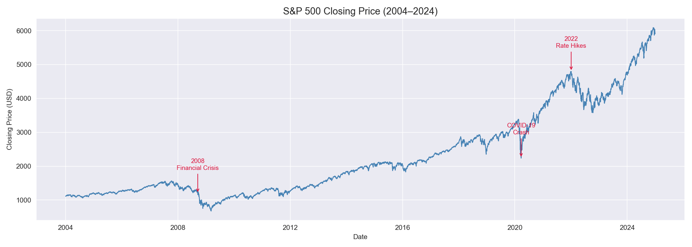
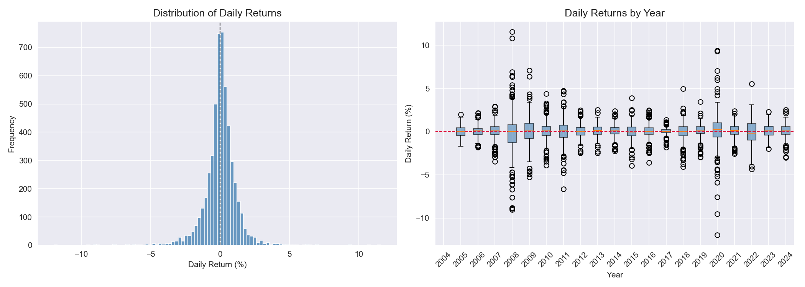
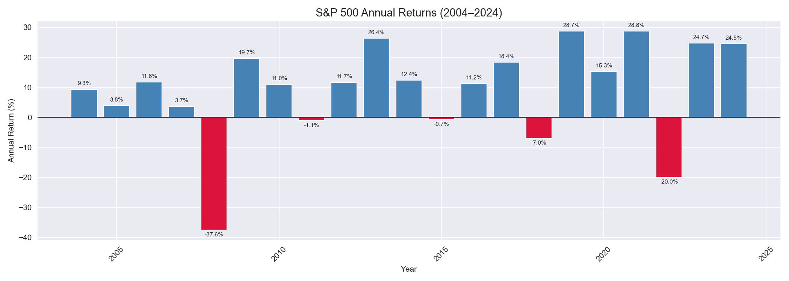
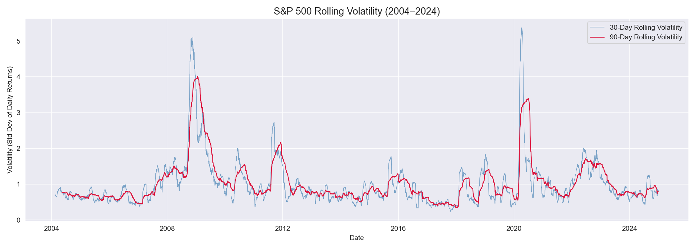
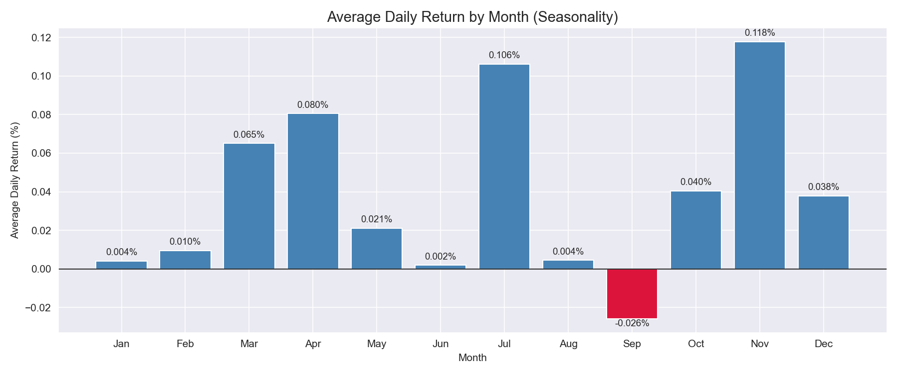

# S&P 500 Stock Market EDA & Trend Analysis

Exploratory data analysis of 20 years of S&P 500 historical price data, examining long-term trends, annual returns, rolling volatility, and seasonal patterns using Python and yfinance.

---

## Problem Statement
Understanding the S&P 500's historical behavior is foundational to financial analysis. This project analyzes 20 years of index data to uncover trend, volatility, and seasonality patterns relevant to investment decision-making.

---

## Data Source
- **Provider:** Yahoo Finance via the `yfinance` Python library
- **Ticker:** ^GSPC (S&P 500 Index)
- **Period:** January 2004 – December 2024
- No CSV download required — data is pulled directly via API

---

## Tools & Libraries
- Python 3.x
- Pandas, NumPy
- Matplotlib, Seaborn
- yfinance

---

## Project Workflow
1. Data retrieval via yfinance API
2. Feature engineering — daily returns, rolling volatility, time columns
3. Long-term price trend analysis with major event annotations
4. Annual and monthly return analysis
5. Rolling volatility analysis across crisis and bull market periods

---

## Key Findings
- The S&P 500 posted positive annual returns in **16 out of 20 years**
- Worst year: **2008 (-37.6%)** — Worst single day: **-11.98%**
- Best year: **2021 (+28.8%)** — Best single day: **+11.58%**
- Volatility spikes sharply and clusters during crisis periods (2008, 2020), confirming that risk is dynamic, not static
- **September** historically shows the weakest average daily returns — consistent with the well-documented "September Effect"
- Every major crash (2008, 2020, 2022) was followed by full recovery and new all-time highs

---

## Visualizations

### 20-Year Closing Price

### Daily Returns Distribution

### Annual Returns

### Rolling Volatility

### Seasonality

---

## Limitations & Next Steps
- Analysis excludes dividend-adjusted returns
- Future work: sector-level breakdown, Monte Carlo simulations, dividend-adjusted total return analysis

---

## How to Run This Project
1. Clone the repository
2. Install dependencies: `pip install pandas numpy matplotlib seaborn yfinance`
3. Open `sp500_analysis.ipynb` in Jupyter or VS Code and run all cells (data pulls automatically from Yahoo Finance — no file download needed)

---

## Author
**Mihrimah Qozat**
[LinkedIn](https://linkedin.com/in/mihrimah-qozat/) | [GitHub](https://github.com/mihrimahqozat)
